#	EJERCICIO2-PORTAINER

-Instalación de portainer:

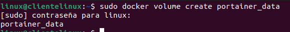

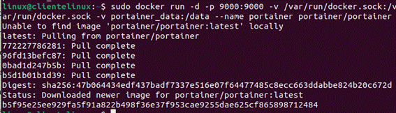

-Accedemos desde el navegador a http://localhost:9000 :

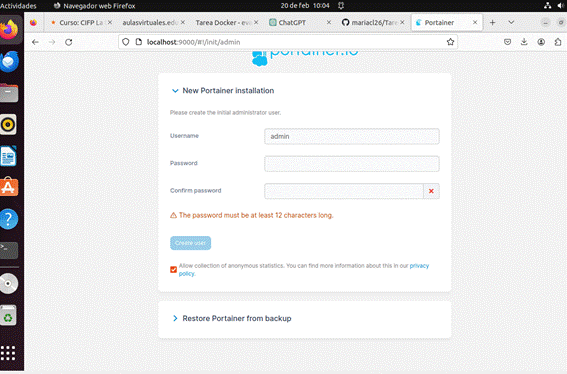

Contraseña : desarrolloweb.

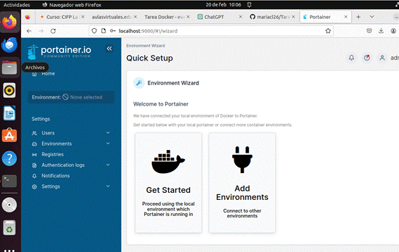

-Gestionamos el contenedor.

Esta es la interfaz de los contenedores:

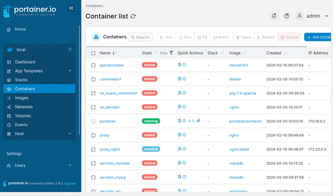

Creo un contenedor:

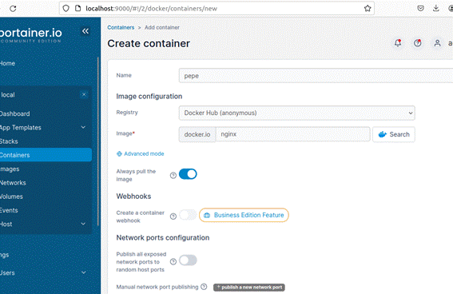

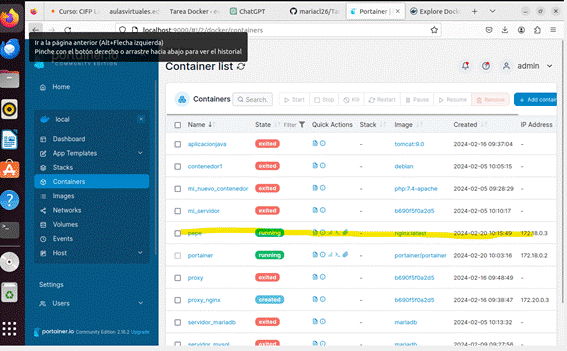

Eliminamos el contenedor:

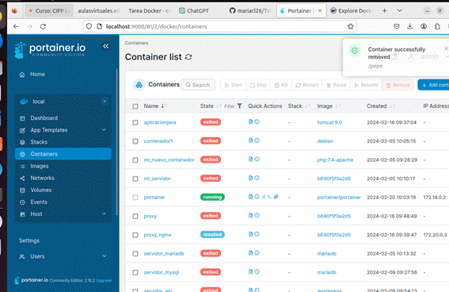

 

-Operación con redes Docker

Panel de las redes:

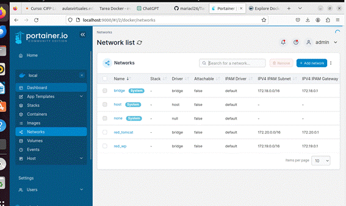

 

 

Voy a conectar una red a un contenedor nuevo:

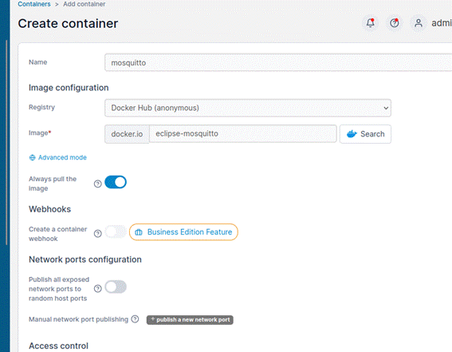

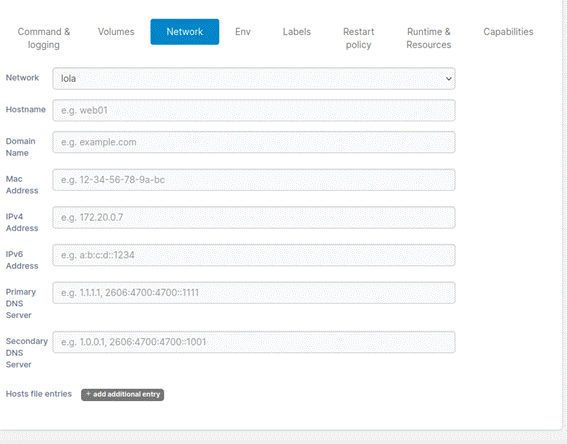

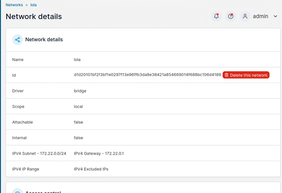

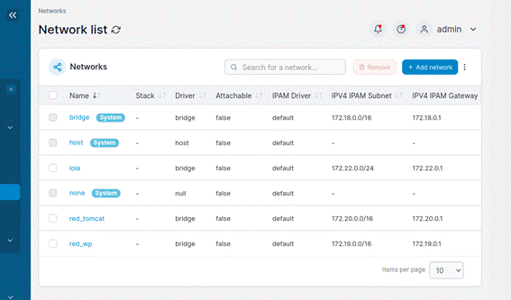

Como se muestra, se comprueba que la ip es la misma que la de la red lola.

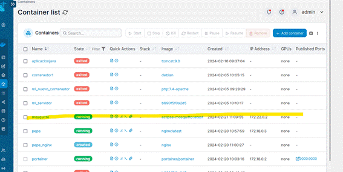

 

 

 

 

 

-Operaciones con volúmenes Docker:

Creo el volumen.

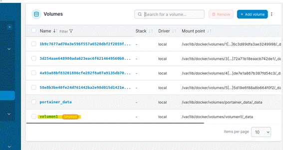

Creo el contenedor nuevo asociándole el volumen1 creado:

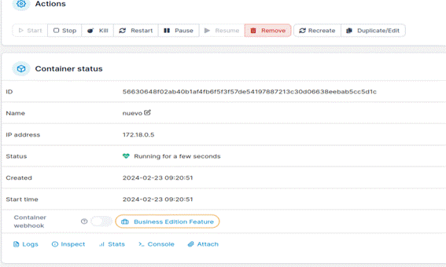

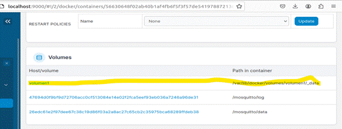